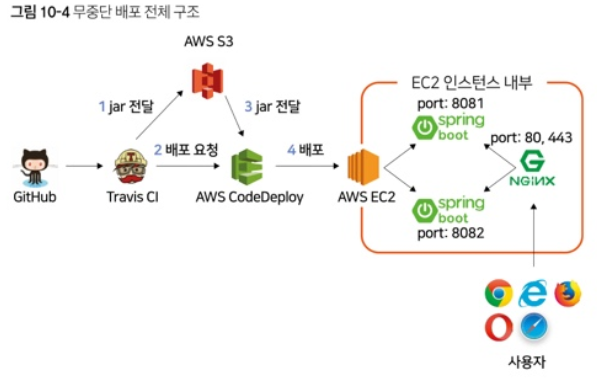
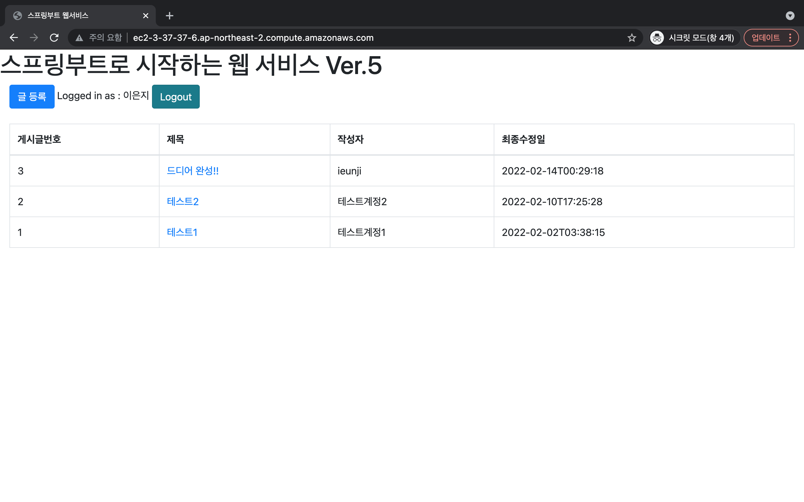

책
# 스프링 부트와 AWS로 혼자 구현하는 웹서비스

## 프로젝트 환경
- Java 8
- Gradle 7.x
- Spring Boot 2.1.x

## 프로젝트 전체 구조

## 프로젝트 완성

## 목적
- 투입된 프로젝트에서 백엔드 개발로 스프링 부트를 사용
- 프로젝트 당시 인텔리제이, 스프링 부트 등 백엔드 개발의 모든 것이 새로웠음
- 구글링 하면 내가 찾던 답의 블로그 글이 거의 모두 이 책의 리뷰 내용
- 다음 프로젝트에서는 덜 헤메기 위해 공부 시작
- 책의 처음부터 끝까지 완료하는 것

## 기간
- 2021.08.11 ~ 2022.02.14( 6개월 )

## 참고
- 책 - 스프링 부트와 AWS로 혼자 구현하는 웹서비스 / 이동욱 지음
- 저자 블로그 [[이동]](https://jojoldu.tistory.com/)

## 후기
다음에는 프론트엔드를 React나 Vue를 사용해서 한번 더 구현해봐도 좋을 것 같다.
